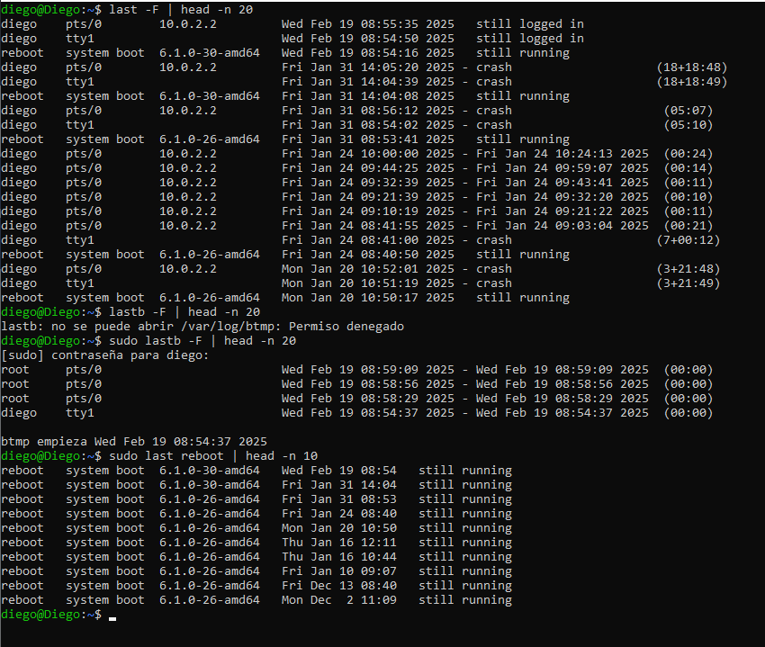
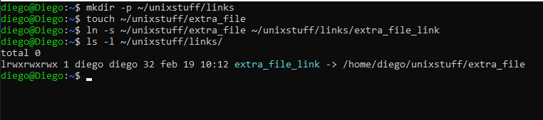
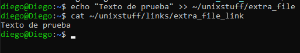
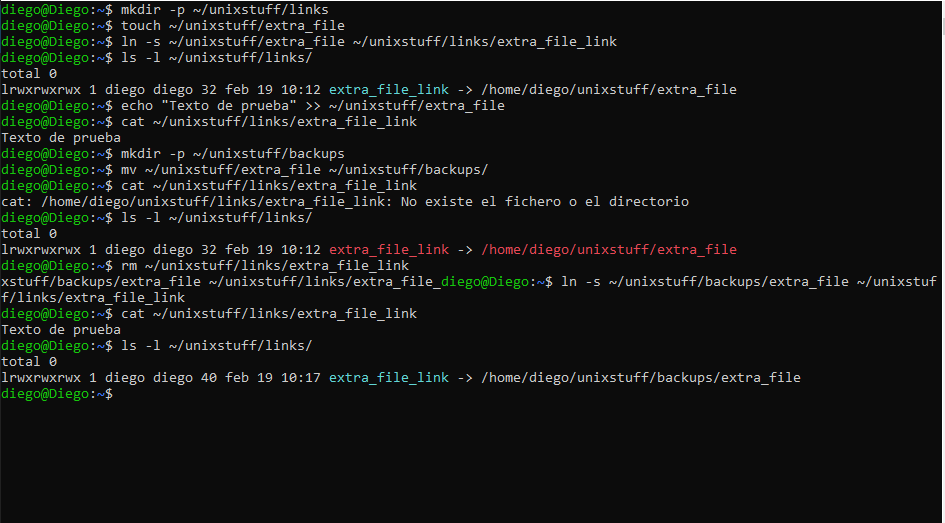
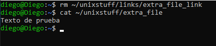
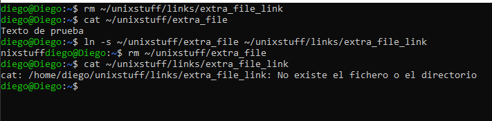
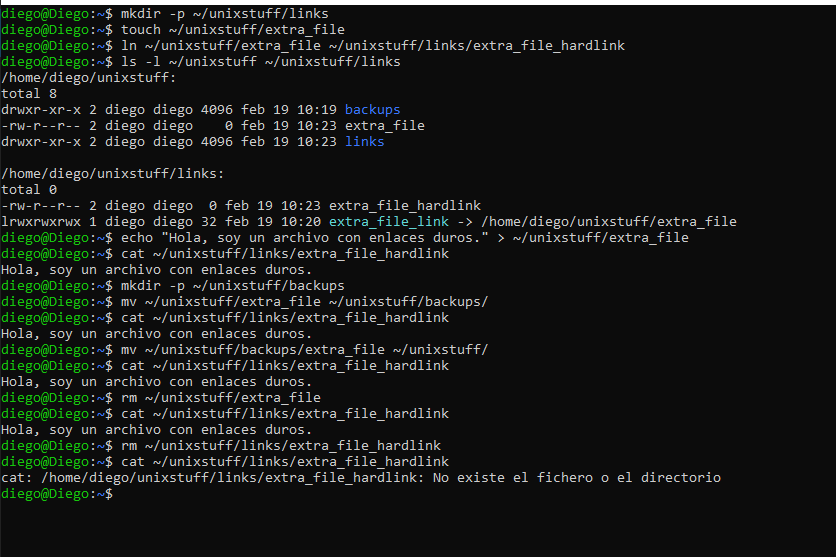
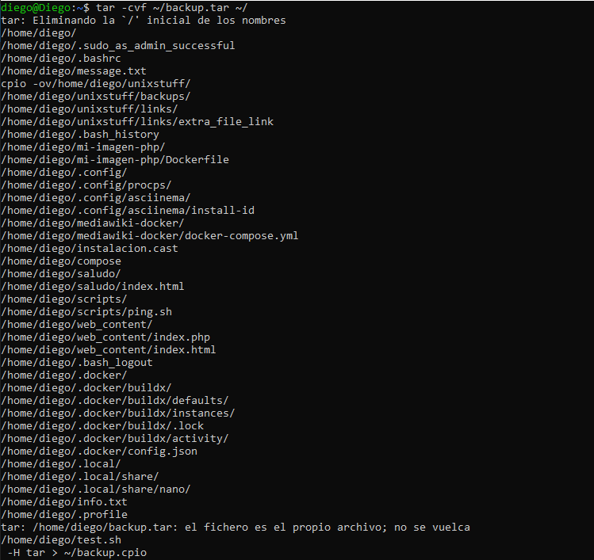
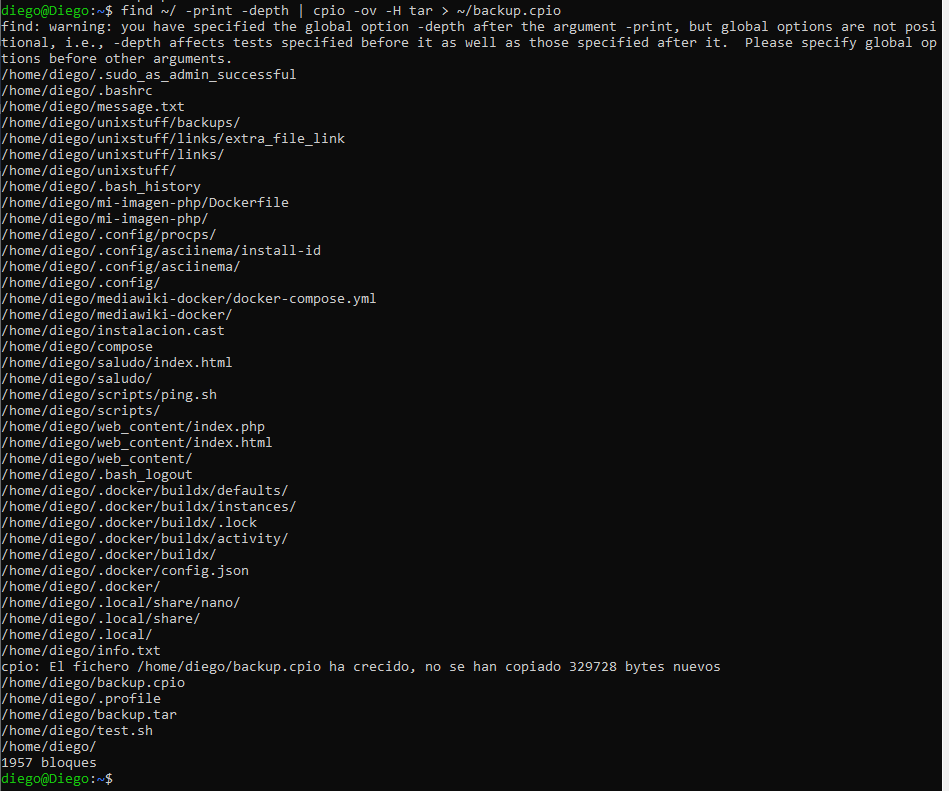
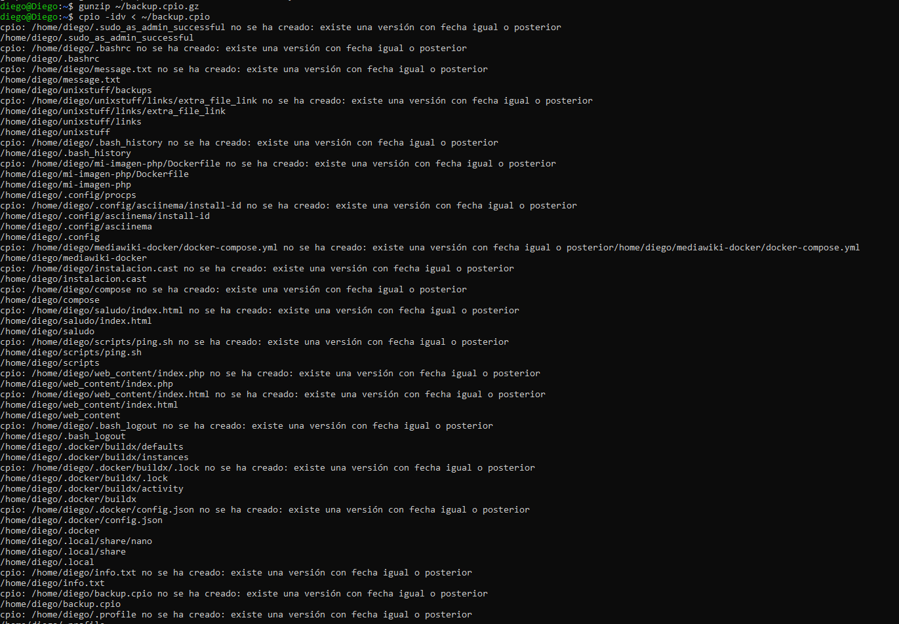

# Exercise 10.1 User and system information 
Before attempting the questions below, you may wish to deliberately reboot the machine and create some failed 
login attempts so that you have some data to work with. 
1. How many login attempts (successful and failed) occurred in the past 48 hours? 
2. How many system reboots occurred in the past 48 hours? 
Symbolic and hard links 
In the * Email under Linux lab, you were introduced to the mail command. In Slackware 13.37, the program is 
actually called mailx.  Some (older) Linux distributions use nail instead. 
46 
Dr J Chin 
Anglia Ruskin University 
Lab 10.  * Further UNIX tools                       
MOD002712 
So how can we tell whether to use mail, mailx or nail? The command 
whereis  program 
tells you the path to the binaries in the system, so the command 
whereis  mailx 
will tell you that mailx is in /usr/bin/mailx (and also return a number of other answers).  If you do the same  for 
mail, you should find that it returns /bin/mail. If you execute 
ls -l /bin/mail 
you will see that /bin/mail is a symlink (symbolic link) to /usr/bin/mailx. Therefore it does not matter if we 
execute mail or mailx:  they are exactly the same.  You may wish to try the above for nail as well. 
Symlinks are similar to shortcuts in Microsoft Windows and aliases in Mac OS X. Symlinks may be created using 
the syntax below: 
ln -s /path/to/original/file /path/to/symlink 
Hard links may be created as above, but without the -s option. 
# Exercise 10.2 Symbolic and hard links  
1. Create a file ~/unixstuff/extra_file and a symlink ~/unixstuff/links/extra_file_link which links to ex- 
tra_file (you may need to create the links directory). Use ls -l whilst in ~/unixstuff/links/ to check 
that the symlink has been created. 
2. Edit extra_file and add some text to it. Now open extra_file_link by executing the following command: 
cat ~/unixstuff/links/extra_file_link 
Do you see the changes you made? 
3. Move extra_file to the backups directory (so its location is now ~/unixstuff/backups/extra_file). 
a) What happens to extra_file_link (if anything)? Hint: try opening the symlink using cat, what is the 
result? Execute ls -l whilst in ~/unixstuff/links/, do you notice anything different? 
b) Move extra_file back to the unixstuff directory – predict what happens to extra_file_link then test 
your prediction. 
4. Delete extra_file_link. What happens to extra_file (if anything – try opening it using cat)? 
5. Recreate the extra_file_link symlink and delete extra_file. What happens to extra_file_link (if anything)? 
See the hint to question 3 (a) if you are stuck. 
6. Delete extra_file_link and redo questions 1 – 5 above, but this time use hard links instead. Hence explain 
the differences between symbolic and hard links. You might also wish to do some research to explain why 
you see these differences. 
File management 
Some useful file management commands are: 
• df (disk free) 
The df command outputs a report on the disk space available. 
47 
Dr J Chin 
Anglia Ruskin University 
Lab 10.  * Further UNIX tools                       
MOD002712 
• diff 
diff allows you to compare the content of two text files and outputs the differences. The syntax is as 
follows: 
diff file1 file2 
Lines in file1 are prefixed with < whilst lines in file2 are prefixed with >. 
• find 
find searches through the file system for files matching specified attributes (such as file name, file contents, 
size). Execute man find to see what options are available. 
• touch 
touch updates the access and modification date and time of a file to the current time. The syntax is as 
follows: 
touch file 
If file does not already exist, it is created with zero contents. 
File compression and  backup 
UNIX systems usually support a number of utilities for backing up and compressing files. The most useful are: 
• tar (tape archiver) 
tar backs up entire directories and files onto a tape device or (more commonly) into a single disk file 
known as an archive. An archive is a file that contains other files plus information about them, such as their 
filename, owner, timestamps, and access permissions. tar does not perform any compression by default. 
To create a disk file tar archive, use 
tar -cvf archivename filename 
where archivename will usually have a .tar extension. Here the -c option means create, -v means verbose 
(output filenames as they are archived), and -f means file. To list the contents of a tar archive, use 
tar -tvf archivename 
To restore files from a tar archive, use 
tar -xvf archivename 
• cpio 
cpio is another facility for creating and reading archives. Unlike tar, cpio doesn’t automatically archive 
the contents of directories, so it’s common to combine cpio with find when creating an  archive: 
find  . -print  -depth  |  cpio  -ov  -H  tar  > archivename 
This will take all the files in the current directory and the directories below and place them in an archive 
called archivename . The -depth option controls the order in which the filenames are produced and is 
recommended to prevent problems with directory permissions when doing a restore. The -o option creates 
the archive, the -v option prints the names of the files archived as they are added and the -H option specifies 
48 
Dr J Chin 
Anglia Ruskin University 
Lab 10.  * Further UNIX tools                       
MOD002712 
an archive format type (in this case it creates a tar archive). Another common archive type is crc, a 
portable format with a checksum for error control. 
To list the contents of a cpio archive, use 
cpio -tv < archivename 
To restore files, use: 
cpio -idv < archivename 
Here the -d option will create directories as necessary. To force cpio to extract files on top of files of the 
same name that already exist (and have the same or later modification time), use the -u option. 
• compress and gzip 
compress and gzip are utilities for compressing and decompressing individual files (which may be or may 
not be archive files). To compress files, use: 
compress filename 
or 
gzip filename 
In each case, filename will be deleted and replaced by a compressed file called filename.Z or filename.gz. 
To reverse the compression process, use: 
compress -d filename 
or 
gzip  -d filename 
zcat can be used to read gzipped text files without uncompressing them first. The output can be piped to 
less if the text file is very long. 
# Exercise 10.3 File compression and backup  
1. Archive the contents of your home directory (including any subdirectories) using tar and cpio. 
2. Compress the tar archive with compress, and the cpio archive with gzip. 
3. Now extract their contents. 

## 1  User and system information
 

## 10.2 Symbolic and hard links
### 1
 

### 2
 

### 3
 

### 4
 

### 5
 

### 6

# Exercise 10.3 File compression and backup
### 1
 
 

### 2
 

### 3
 