# Shell scripting

## Exercise 3.1 Creating an executable bash script  
1. Using vi (or another terminal text editor such as emacs), create a script called test.sh in your home directory 
with the following contents: 
#!/bin/bash 
clear 
echo  "Hello World" 
Make sure the script is executable, then run it by executing: ./test.sh 
2. A student, when completing the above question, executed the following command: 
chmod  777  test.sh 
(equivalent to executing chmod a+rwx test.sh) 
Explain why giving 777 permissions to a file is a bad idea. 

## Resultado
1. 

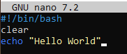

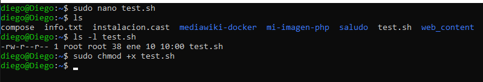

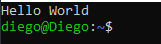

2. 
Se crearia un problema de seguridad porque todo el mundo tendria acceso.

## Exercise 3.2 Creating new users 
Create two new user accounts: 
• username: bob, password: bob 
• username:  smith, password: smith 

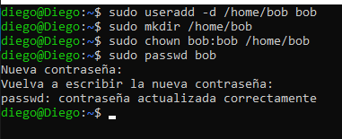

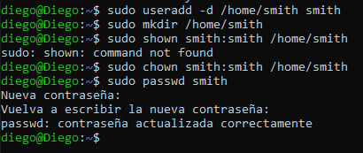

## Exercise 3.3 Creating a shared executable script  
1. Create a publically readable and writeable directory with the path /home/ncs with the appropriate directory 
permissions. 
2. Create a bash script in this directory called hello.sh which should print a message saying “Hello World”. 
3. Execute this script. 
4. Note down the owner/group ownerships and the file permissions of this script.

1. 
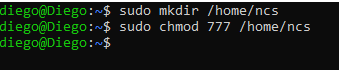

2. 
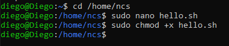

3. 
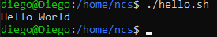

4. 
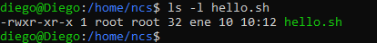

## Exercise 3.4 Accessing files from different user accounts  
a) Press [Ctrl] + [Alt] + [F2] and log in as bob. 
1. Navigate to the directory /home/ncs. What do you see in this directory? 
2. Execute ./hello.sh. Does it succeed? Why (not)? 
3. Create a script called bob.sh, which should print the message “Hello this is Bob” when executed. 
4. Execute ./bob.sh and explain the result you get. 
b) Press [Ctrl] + [Alt] + [F3] and log in as smith. 
1. Navigate to the directory /home/ncs. What do you see in this directory? 
2. Execute ./hello.sh and ./bob.sh. Explain the results you get.

a)
1. 
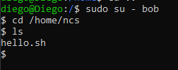

2. Si funciona porque lo hemos hecho publico para que cualquier usuario pueda acceder
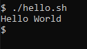

3. 
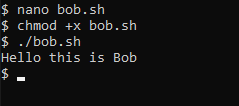

4. 
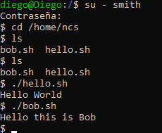
Habia creado bob.sh con sudo y por eso le daba todo los permisos, lo he borrado y vuelto a crear, ahora no puedo acceder con el usuario smith
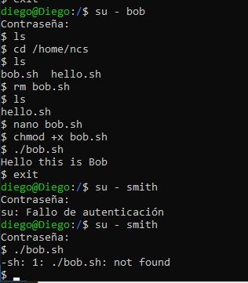

b)
1. 
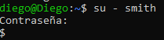
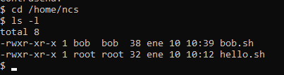
2. 
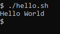
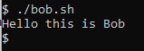
Se pueden ejecutar porque smith tiene permisos de ejecución de ambos

## Exercise 3.5 Optional exercises
These exercises require you to read up on additional material.
1. Create a group called sysadmins, and add bob and smith as members. Change the group owner of
/home/ncs, /home/ncs/hello.sh and /home/ncs/bob.sh to this group. Can both bob and smith execute
both scripts now?
2. Disable smith’s user account. Do not delete smith’s account or files.

1. 
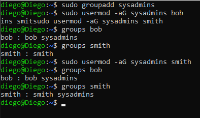
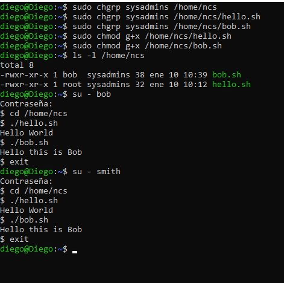

Al cambiar el grupo propietario a sysadmins y dar permisos de ejecución al grupo, tanto bob como smith pueden ejecutar ambos scripts.

2. 
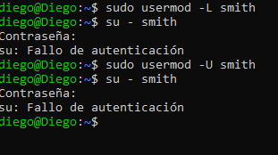
Cuando deshabilitas la cuenta de smith, el usuario no puede iniciar sesión ni ejecutar comandos, pero sus archivos y configuraciones permanecen intactos.
