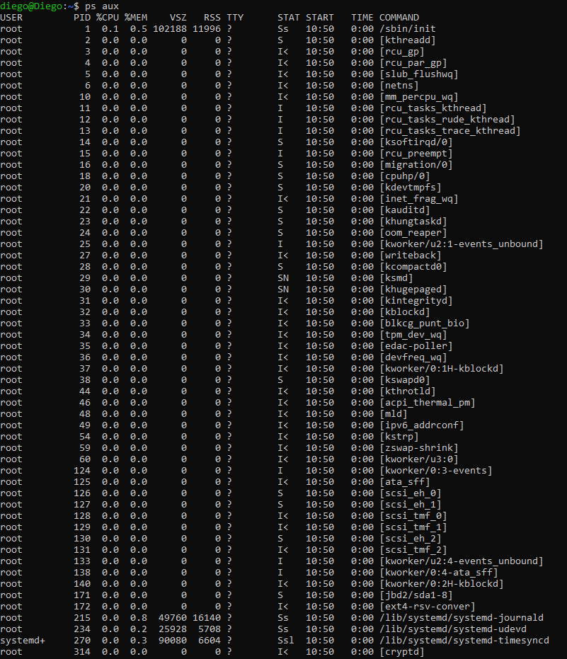

# Daemons
## Exercise 4.1 Exploring currently running processes
Using ps aux and top (and any other commands you feel would be useful), find out the total number of processes
that are currently running. Identify the 10 most CPU-intensive processes and give a brief (one sentence) description of what each of them do. Hint: you can use ps aux | less to scroll through the list and man command to
find out more about a command.
Dr J Chin 24 Anglia Ruskin University
Lab 4. * Daemons and processes MOD002712
Listing suspended and background processes
When a process is running, suspended or in the background, it will be entered onto a list along with a job number.
To examine this list, execute
jobs
An example of a job list could be:
1. Suspended sleep 100
2. Running netscape
3. Running nedit
To restart (or foreground) a suspended processes, execute
fg %job_number
For example, to restart sleep 100 in the above example, execute
fg %1
Executing fg with no job number foregrounds the last suspended process. To resume a suspended process in the
background, the bg command is used instead.
Looking up processes
It is useful to be able to look up a particular process/daemon. Sometimes a port scan will do the job.
nmap is a network discovery utility useful for managing network services. It uses raw IP packets to determine the
network hosts and the services (application name and version) they offer as well as the type of operating systems
(and OS versions) that they are running

1. 

### init (PID: 1):

Descripción: init es el proceso principal de arranque del sistema. Es el primer proceso que se ejecuta durante el inicio del sistema y es responsable de inicializar otros procesos del sistema y servicios. También gestiona el ciclo de vida de los procesos y servicios del sistema.

### kworker/0:3-events (PID: 124):

Descripción: Este es un proceso del kernel relacionado con el manejo de eventos de hardware. Los procesos kworker son generados por el kernel de Linux para manejar eventos y tareas de mantenimiento del sistema. El número (0:3) representa el trabajador específico que está procesando eventos.

### dockerd (PID: 598):

Descripción: dockerd es el demonio del contenedor Docker. Es el proceso principal que ejecuta Docker, el cual gestiona los contenedores y las imágenes. Cuando Docker inicia, este proceso se encarga de gestionar y ejecutar contenedores en el sistema.

### mariadbd (PID: 591):

Descripción: mariadbd es el demonio del servidor de base de datos MariaDB. Es el proceso que maneja todas las solicitudes de bases de datos y operaciones de lectura y escritura en el sistema de bases de datos MariaDB.

### containerd (PID: 450):

Descripción: containerd es otro proceso relacionado con Docker. Es un daemon que gestiona la ejecución y supervisión de contenedores. Docker depende de containerd para la ejecución de contenedores y la interacción con el sistema de contenedores.

### systemd-journald (PID: 215):

Descripción: systemd-journald es un proceso del sistema que gestiona los logs del sistema (diarios). Es parte de systemd y se encarga de almacenar y manejar los registros del sistema (logs) de forma eficiente.

### sshd: diego@pts/0 (PID: 1035):

Descripción: sshd es el demonio de SSH, que permite las conexiones remotas seguras al sistema. En este caso, el proceso es una sesión de sshd que está manejando una conexión SSH iniciada por el usuario diego desde el terminal pts/0.

### login (PID: 1003):

Descripción: El proceso login es el que maneja las conexiones de inicio de sesión de los usuarios. En este caso, el proceso login está gestionando la sesión del usuario root en el terminal tty1.

### systemd-udevd (PID: 234):

Descripción: systemd-udevd es un proceso del sistema responsable de manejar los eventos de dispositivo del sistema. Se encarga de detectar y configurar automáticamente el hardware del sistema (como discos duros, dispositivos USB, etc.) cuando se conectan o desconectan.

## Exercise 4.2 Exploring network processes
Execute the command nmap localhost. Write down all the processes returned and explain their purpose.
To look for a particular process, execute
ps aux | grep process_name
Starting processes
Processes are listed in /etc/rc.d/ directory. To start a process/daemon simply lookup the name of the process/daemon and execute
/etc/rc.d/process_name start
Dr J Chin 25 Anglia Ruskin University
Lab 4. * Daemons and processes MOD002712
Stopping a currently running process
A currently running process can be terminated using the command kill, which sends a signal to the selected
process. There are several different types of signal: signal 9 (SIGKILL) will terminate the process immediately
whilst signal 1 (SIGHUP) will wait until all other dependent child processes are terminated.
To stop a running process one must need to know the process ID. Once you know the process ID, then
kill -9 process_id or kill -SIGKILL process_id
will kill the process immediately

### Puerto 22 (SSH)
Estado: open (abierto).
Servicio: ssh (Secure Shell).
Propósito:
El puerto 22 es utilizado por el protocolo SSH, que permite la administración remota y segura de sistemas. SSH proporciona cifrado para conexiones a través de la red, asegurando que las credenciales y la información transferida estén protegidas.

### Puerto 3306 (MySQL)
Estado: open (abierto).
Servicio: mysql.
Propósito:
El puerto 3306 es el puerto predeterminado para MySQL o MariaDB, que son sistemas de gestión de bases de datos relacionales. Este servicio permite que aplicaciones o usuarios se conecten a las bases de datos alojadas en el servidor para ejecutar consultas SQL o gestionar datos.

## Exercise 4.3 Exploring UNIX signals
Execute the command kill -l. Explain what this command does and use a table to summarise the results(signal
number,signal name,short description). You only need to considersignal numbers 1 – 9, and five more of your
choice between signal numbers 10 and 31. Please rememberto cite any sourcesthat you use to answerthis
exercise using a recognised academic referencing system(seehttp://libweb.anglia.ac.uk/referencing/
referencing.htm).

| **Número** | **Señal**    | **Descripción**                                         |
|------------|--------------|---------------------------------------------------------|
| 1          | SIGHUP       | Hangup detectado en la terminal o proceso.              |
| 2          | SIGINT       | Interrupción enviada desde el teclado (Ctrl+C).         |
| 3          | SIGQUIT      | Salida desde el teclado (Ctrl+\).                       |
| 4          | SIGILL       | Instrucción ilegal detectada por el procesador.         |
| 5          | SIGTRAP      | Trampa o punto de interrupción alcanzado.               |
| 6          | SIGABRT      | Abort generado por la llamada abort().                  |
| 7          | SIGBUS       | Error de bus (acceso inválido a memoria).               |
| 8          | SIGFPE       | Error en operación de coma flotante.                   |
| 9          | SIGKILL      | Señal para terminar un proceso inmediatamente.          |
| 10         | SIGUSR1      | Señal de usuario 1 (definida por el usuario).           |
| 11         | SIGSEGV      | Violación de segmento (acceso inválido a memoria).      |
| 12         | SIGUSR2      | Señal de usuario 2 (definida por el usuario).           |
| 13         | SIGPIPE      | Escritura en un pipe sin lectores.                      |
| 14         | SIGALRM      | Temporizador expirado.                                  |
| 15         | SIGTERM      | Terminación solicitada (por defecto en kill).           |
| 16         | SIGSTKFLT    | Error de pila en sistemas específicos.                  |
| 17         | SIGCHLD      | Proceso hijo terminó o cambió de estado.                |
| 18         | SIGCONT      | Continúa un proceso detenido.                           |
| 19         | SIGSTOP      | Detiene un proceso (sin opción de ignorar).             |
| 20         | SIGTSTP      | Detención solicitada desde el teclado (Ctrl+Z).         |
| 21         | SIGTTIN      | Proceso de fondo intenta leer de la terminal.           |
| 22         | SIGTTOU      | Proceso de fondo intenta escribir en la terminal.       |
| 23         | SIGURG       | Actividad urgente en un socket.                         |
| 24         | SIGXCPU      | Exceso en límite de tiempo de CPU.                      |
| 25         | SIGXFSZ      | Exceso en límite de tamaño de archivo.                  |
| 26         | SIGVTALRM    | Temporizador de tiempo virtual expirado.                |
| 27         | SIGPROF      | Temporizador de perfil expirado.                        |
| 28         | SIGWINCH     | Cambio en el tamaño de la ventana de terminal.          |
| 29         | SIGIO        | Evento de E/S asincrónico.                              |
| 30         | SIGPWR       | Señal de fallo de energía.                              |
| 31         | SIGSYS       | Llamada al sistema inválida.                            |
| 34-64      | SIGRTMIN+N   | Señales de tiempo real para aplicaciones personalizadas. |

## Exercise 4.4 Processes and networking
You created the bob user account in Exercise 3.2 on page 22, check that it exists before completing this exercise.
When completing this exercise, please remember to provide screenshots in your logbook to demonstrate your
results.
1. Edit /etc/inetd.conf to enable ftp and telnet. Restart inetd and execute ftp localhost and telnet
localhost and log in as bob to see if they are enabled. Make sure you know how to upload, download,
delete andrename files.Hint: use thevsftpddaemon.Its configurationfileislocatedat: /etc/vsftpd.conf.
2. Edit /etc/inetd.conf again to disable ftp. Restart inetd and test out your changes.
3. What is sftp and ssh? Why is the use of telnet discouraged in the “real world”?

¿Qué es SFTP y SSH?: SFTP es un protocolo seguro para transferir archivos, y SSH es un protocolo seguro para conexiones remotas.
¿Por qué se desaconseja el uso de Telnet en la “vida real”?: Telnet transmite la información sin cifrado, lo que lo hace inseguro para comunicaciones sensibles.

## Exercise 4.5 Optional exercises
1. How could you combine pidof with kill -HUP in order to restart inetd in one command? Hint: try
using quotation marks (such as: 1,", `).
2. Can you ftp as root? Is it a good idea to be able to ftp as root and why? If so, in what context?
3. From your Windows host machine, ftp and telnet to your Slackware virtual machine.

2. 
¿Puedes FTP como root? Sí, es técnicamente posible FTP como root, pero no es una buena práctica en la mayoría de los casos.

¿Es una buena idea FTP como root? No, no es recomendable FTP como root, y aquí te explico por qué:

Riesgos de seguridad: FTP es un protocolo no cifrado, lo que significa que toda la información (incluyendo las credenciales de inicio de sesión y los archivos transferidos) se envía en texto claro. Si te conectas como root, estarías transmitiendo tus credenciales de acceso como superusuario sin ningún tipo de protección, lo que puede ser un blanco fácil para un atacante.

Acceso completo al sistema: FTP como root significa que cualquier usuario con acceso a esa sesión FTP puede obtener acceso completo al sistema, lo que representa un riesgo de seguridad enorme.

¿En qué contexto sería útil? FTP como root solo debería ser permitido en entornos muy controlados y con medidas de seguridad adicionales, como el uso de un túnel SSH para proteger las transmisiones. Sin embargo, la mejor práctica es evitar el uso de root a través de FTP.

3. 
### Pasos para FTP
