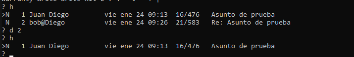

# Exercise 6.1 Sending email using mail
1. Create a file called message.txt with some text, then redirect it to mail using the syntax above to send it to
bob.
2. Explain what the following command does:
echo "Welcome to Network Computer Systems" | mail -s "Hello world"
bob@anglia.bryant -c smith@anglia.bryant -b root@anglia.bryant
A major drawback of mail is that it does not support attachments. Two popular text-based email programs that
do are mutt and alpine. Both of these programs are included with Slackware by default, and you may wish to
explore them. mutt in particular is a very powerful email client – if you can manage its steep learning curve, you
will be able to organise your email very quickly (similar to how using the command line can be much quicker than
using a graphical interface).
Reading email
You may have noticed the message “You have mail” when you log in to the Slackware machine. To read email,
simply execute
mail
If you have any unread email, you will be presented with a summary of the unread messages.
# Exercise 6.2 Checking email
Loginasbob(youcanexecutesu bob,thenexitwhenyouarefinished)andcheckthatallemailssenttobob
are present. If they are not, check that sendmail is running. (If sendmail is not running, the emails are saved in
/var/spool/mqueue/ and will be sent once you start thedaemon.)
Dr J Chin 31 Anglia Ruskin University
Lab 6. * Email under Linux MOD002712
# Exercise 6.3 Exploring mail
You should complete this exercise as bob, not root.
1. Describe, using appropriate screenshots, howto do the following inmail:read,reply,send, delete,list and
save messages. Hint: to display help in mail, type [?].
2. What is contained in /var/spool/mail/? What are the security implications ofthis?
3. From your Windows host machine,telnetto your virtual machine on port 25 (telnet ip_address 25)
and sendamessage tobob@localhostfromyour_name@localhost bytalkingtotheSMTPserver. The
message body text and subject can be anything you like. Hint: followthe example SMTP session on page
33.
4. Enable POP3. Hint: look in /etc/inetd.conf. Also, you should remember that you need to do something
after saving changes to a configuration file to make those changes take effect... (refer to Lab 4 on page 23)
5. From your Windows host machine, telnet to your virtual machine on port 110. Explore talking to the
POP3server.Hint:followthe examplePOP3sessiononpage33.
6. What ports are used by SMTP and POP3?
# Exercise 6.4 Optional exercises
1. What is IMAP? List the differences between POP3 andIMAP.
2. What is PGP encryption? How does it work?

# 6.1 Enviar correo usando mail
1. 

2. 
**echo "Welcome to Network Computer Systems"**: Este comando genera el texto "Welcome to Network Computer Systems" y lo pasa como entrada a través de una tubería (`|`).

**mail -s "Hello world"**: El comando `mail` se utiliza para enviar un correo electrónico. El `-s` especifica el asunto del correo, que en este caso es "Hello world".

**bob@anglia.bryant**: Es el destinatario del correo.

**-c smith@anglia.bryant**: Esto especifica que también se debe enviar una copia del correo a `smith@anglia.bryant` (como "copia a").

**-b root@anglia.bryant**: Esto especifica que se debe enviar una copia oculta (copia oculta, CC) a `root@anglia.bryant`.

# 6.2 Verificar el correo

# 6.3 Explorando mail
1. 

2. 
El directorio /var/spool/mail/ generalmente contiene los buzones de correo de los usuarios del sistema. Cada archivo en este directorio corresponde a un usuario y almacena los mensajes de correo electrónico que han recibido. Las implicaciones de seguridad son que si un atacante tiene acceso a este directorio, podría leer los correos electrónicos de los usuarios, lo que podría revelar información sensible. Es importante que este directorio tenga los permisos adecuados para proteger la privacidad de los usuarios.

3. 

4. 

5. 

6. 
 ### Puertos utilizados por los protocolos:

- **SMTP**: Puerto 25.
- **POP3**: Puerto 110.

# 6.4 Ejercicios opcionales
## ¿Qué es IMAP? Diferencias entre POP3 e IMAP

**IMAP** (Internet Message Access Protocol) es un protocolo utilizado para acceder a los correos electrónicos almacenados en un servidor. A diferencia de **POP3**, que descarga los mensajes a tu dispositivo y los elimina del servidor, IMAP permite acceder a los mensajes sin descargarlos, manteniéndolos en el servidor.

### Diferencias:

- **POP3:** Los correos se descargan y se eliminan del servidor.
- **IMAP:** Los correos se mantienen en el servidor, y puedes acceder a ellos desde varios dispositivos.

## ¿Qué es la encriptación PGP? ¿Cómo funciona?

**PGP** (Pretty Good Privacy) es un sistema de cifrado utilizado para asegurar correos electrónicos. Utiliza un sistema de claves públicas y privadas. La persona que envía el mensaje cifra el correo con la clave pública del destinatario, y el destinatario lo descifra con su clave privada. Esto garantiza que solo el destinatario pueda leer el mensaje y protege la integridad del correo.
