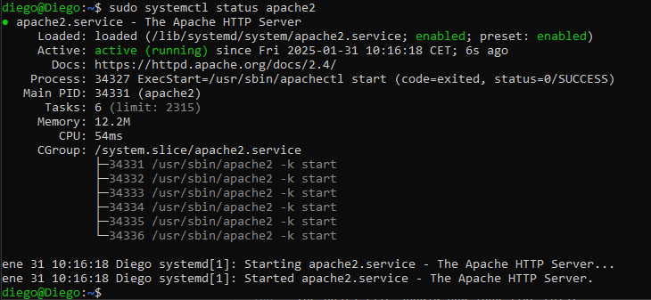

# Exercise 7.1 Configuring Apache 
Whilst /etc/httpd/httpd.conf is still open, answer the following questions. 
1. Lines that start with a # are comments: what are the purpose of these? 
2. Find the default values of ServerName and DocumentRoot and note them down. (Uncomment the line 
containing ServerName.) What do they do/mean? 
3. Uncomment the line Include /etc/httpd/mod_php.conf. What does this do? 
Make sure you save the changes made before continuing. 
33 
Dr J Chin 
Anglia Ruskin University 
Lab 7.  * Apache HTTP server and PHP                       
MOD002712 
Running Apache 
The following commands will start, stop and restart httpd, the Apache HTTP daemon, respectively (you may 
need to chmod /etc/rc.d/rc.httpd first so that it is executable: this also makes httpd run on startup): 
/etc/rc.d/rc.httpd start 
/etc/rc.d/rc.httpd stop 
/etc/rc.d/rc.httpd restart 
If you make any configuration changes to Apache whilst httpd is running (including httpd.conf), you must restart 
httpd for those changes to take effect. (Refer to Lab 4 on page 23 if you are stuck.) 
You can check if httpd is running by executing the following command 
ps  aux  |  grep httpd 
# Exercise 7.2 Running Apache  
1. Why do you need to restart httpd if you make changes to the configuration? 
2. This question is about the command ps  aux  |  grep  httpd. 
a) What does the command ps  aux do? What  about  the  command  grep  httpd?   What does “|” 
mean? Hence, explain what the command ps  aux  |  grep  httpd  does. 
b) What would you expect to see as the output of the command ps aux | grep httpd if httpd is 
running? How about if it is not running? Try both cases and note down the results. 
3. By executing ps axl | egrep "httpd|PPID" (make sure you copy this command exactly: note the 
spacing and capital letters), find the process ID of the parent httpd process (the PPID). 
Creating and viewing HTML  files 
Earlier in the lab (Exercise 7.1 on the preceding page), you noted down the default value of DocumentRoot from 
the Apache configuration file, which is a directory. Navigate to this directory. A file named index.html should 
already exist in this directory with the following HTML code: 
<html><body><h1>It works!</h1></body></html> 

# Exercise 7.3 Creating HTML files  
1. What is special about index.htm and index.html files? 
2. Find out the permissions and file and group ownership of index.html. 
3. Create a new file called test.html with the following source code: 
<html> 
<head><title>NSE   Apache  Lab</title></head> 
<body> 
<h1>This  is  the  NSE  Apache  Lab  test page</h1> 

Under   construction!
 
</body> 
</html> 
Draw out, on paper, what you expect to see if you opened test.html in a web browser. 
34 
Dr J Chin 
Anglia Ruskin University 
Lab 7.  * Apache HTTP server and PHP                       
MOD002712 
We would normally use a web browser to view HTML files (such as Mozilla Firefox or Google Chrome), however, 
since we are running Slackware using a CLI rather than a GUI, we will use a command-line web browser called 
lynx. 

# Exercise 7.4 Viewing HTML files using a terminal interface  
1. Explain the difference between CLI and GUI. 
2. What is special about the IP address 127.0.0.1? 
3. View the HTML file in lynx by executing 
lynx  127.0.0.1/test.html 
If the HTML file does not load, check to see if httpd is running and that the HTML file is saved in the 
correct location and has appropriate file permissions and file owner. Press the [=] button to see more 
information about the web page (including the page title and URL). Take a screenshot of this screen. To exit 
lynx, press [q] and then [y]. 
4. (Optional) Find out the IP address of the virtual machine, then view the file using your Windows host 
machine by opening a web browser (such as Mozilla Firefox or Google Chrome) and navigating to 
http://replace_with_ip_address /test.html. 
Creating and viewing PHP  files 
In the same directory as index.html, create a new file called nse.php with the following code: 
<?php 
phpinfo(); //test if PHP  is working 
?> 
Exercise 7.5 Creating and viewing PHP files using a terminal interface  
1. What does phpinfo(); do? 
2. Load the file in lynx by executing 
lynx 127.0.0.1/nse.php 
Take a screenshot of the result. The page should be titled “phpinfo()”, the phrases “PHP Logo” and “PHP 
Version 5.x.x” should appear at the top of the page and you should see a lot of information about the Apache 
configuration. If you just see the source code of nse.php, open the Apache configuration file (httpd.conf), 
check that PHP is enabled, then restart httpd. 
The hosts file 
The hosts file maps a hostname to an IP address on the local machine. Earlier in the lab (Exercise 7.1), you noted 
down the default value of ServerName from the Apache configuration file. We will host ServerName on our 
local machine by adding an entry to the hosts file. 
35 
Dr J Chin 
Anglia Ruskin University 
Lab 7.  * Apache HTTP server and PHP                       
MOD002712 
Exercise 7.6 Exploring and adding an entry to the hosts file 
Using a text editor, open the file /etc/hosts. You should see the following: 
#  For  loopbacking  127.0.0.1 
localhost 
# This next entry is technically wrong, but good enough to get TCP/IP apps 
# to quit complaining that they can’t verify the hostname on a loopback-only 
#  Linux  box 
127.0.0.1 
#  End  of hosts. 
darkstar.example.net 
darkstar 
Add the following line to the hosts file on the line just above #  End  of  hosts.: 
127.0.0.1   replace with ServerName 
Note:  In Exercise 7.1, you noted down the default value of ServerName – use this without the port number e.g. 
www.example.com 
The hosts file should now look like this: 
#  For  loopbacking  127.0.0.1 
localhost 
# This next entry is technically wrong, but good enough to get TCP/IP apps 
# to quit complaining that they can’t verify the hostname on a loopback-only 
#  Linux  box 
127.0.0.1 
127.0.0.1 
#  End  of hosts. 
darkstar.example.net 
www.example.com 
Save the file and exit the text editor. Now execute 
lynx  replace with ServerName 
Does it work? Press the [=] button and take a screenshot. 

# 7.1 

# 7.2 

# 7.3 

# 7.4 

CLI (Interfaz de Línea de Comandos) → Basada en texto.
GUI (Interfaz Gráfica de Usuario) → Usa ventanas y gráficos.

# 7.5 

# 7.6 

