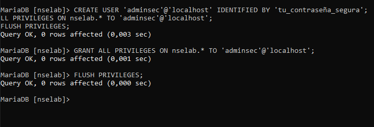

# Exercise 8.1
1. By executing SELECT User, Host FROM mysql.user; find out the number of entries in the user table
in the mysql database.
2. What are the commands to create and delete a table, and to select data from a table? What about inserting data into a table? Hint: use the MySQL manual (http://dev.mysql.com/doc/refman/5.1/en/
tutorial.html)
3. Create a database called nselab. Within this database, create a table called users, with three fields: studentid, firstname and lastname. Make studentid the primary key field. This field cannot be empty for any
record and should automatically increase by one each time a new record is added (the first record should
have a studentid of 1, the second 2 etc.) The other two fields should be limited to a maximum of 25 characters each. Add two students to this table: Joe Bloggs and Ashley Smith. Devise a plan to test the validation
rules (this will involve adding more records) and carry it out.
# Exercise 8.2 Optional exercises
1. Create a MySQL user called adminsec and grant it full privileges to the nselab database only (and no
privileges, including viewing, to any other database). You will need to look up the syntax (don’t try to do
this by editing the mysql database directly).
2. Create a web page using PHP that can display the data in the users table in the nselab database. You
should try to show in your logbook that you understand what the code does – this could be achieved
by annotating the code with comments. (If you are new to PHP, you will need to do some independent research. You may find the following tutorial helpful: http://www.lynda.com/MySQL-tutorials/
PHP-MySQL-Essential-Training/119003-2.html. You will need to follow the instructions here to log
in: http://web.anglia.ac.uk/it/training/lynda/.)

# 8.1
1. 

2. 
## Crear una tabla

CREATE TABLE users (
    id INT AUTO_INCREMENT PRIMARY KEY,
    nombre VARCHAR(50),
    edad INT
);

## Eliminar una tabla 
DROP TABLE users;

## Selecionar datos de una tabla
SELECT * FROM users;

## Insertar datos en una tabla
INSERT INTO users (nombre, edad) VALUES ('Juan', 25);

3. 

# 8.2

